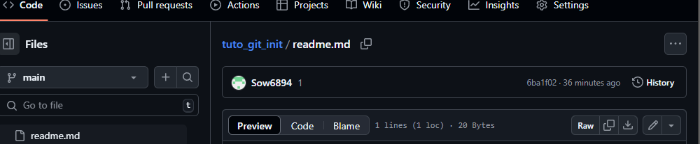

Tuto initiation git
------------------

Préalable. Création d'un repo distant sur la plateforme  
1 . Création d'un dossier sur le PC -> pour le moment un dossier classique  
2 . on créé le premier fichier readme.md (qui va etre la pâge d'acueil de notre repo)  
3 . on initialiser ce dossier classique, comme un repo local avec la commande  
```git init```    
Cette commande entraine la création d'un sous répertoire .git, notre dossier "classique"  

Mon image

